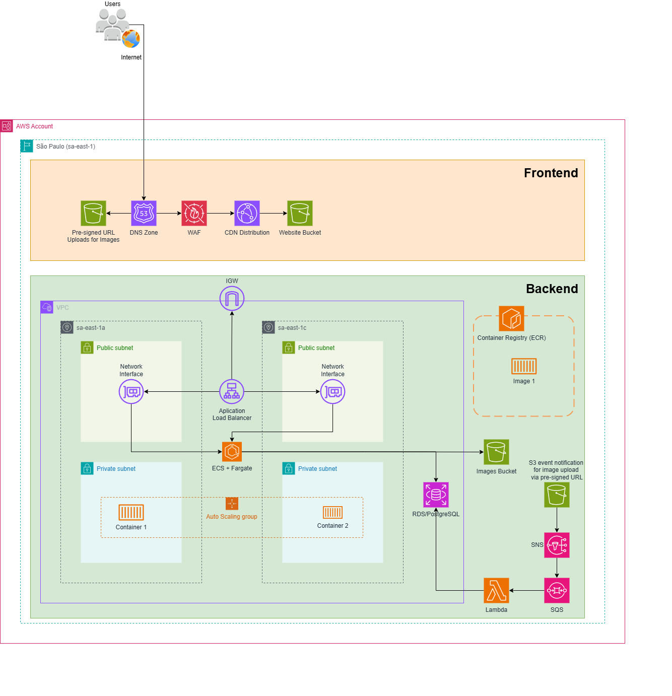

# RADIOSCAN — Terraform

Complete infrastructure for the **radioscan** application, simulating AWS via **LocalStack**, covering: static site (S3 + CloudFront + WAF + Route53), Java API on ECS/Fargate, RDS PostgreSQL database, and the AI-based X-ray analysis pipeline (S3 → SNS → SQS → Lambda with TensorFlow → RDS).

<br>

## Solution Architecture Diagram



<br>

## Architecture

| Layer          | Terraform File        | Key Resources                                                                                                                                                            |
| -------------- | --------------------- | ------------------------------------------------------------------------------------------------------------------------------------------------------------------------ | -------------------------------------------------- |
| Network        | `main.tf`             | VPC, public/private subnets, IGW, NAT, route tables                                                                                                                      |
| Frontend       | `frontend.tf`         | `aws_s3_bucket.website`, `aws_cloudfront_distribution.cdn`, `aws_wafv2_web_acl.cdn`, `aws_route53_zone.this`                                                             |
| Backend (API)  | `main.tf`             | ALB, ECS Cluster/Service/Task (Fargate), ECR, IAM roles                                                                                                                  |
| Database       | `database.tf`         | `aws_db_instance.this` (PostgreSQL, private subnets)                                                                                                                     |
| Image Pipeline | `messaging-images.tf` | `aws_s3_bucket.images`, `aws_sns_topic.image_upload`, `aws_sqs_queue.image_processing` (+ DLQ), `aws_lambda_function.image_processor`, `aws_ecr_repository.lambda_model` | Image pipeline flow (100% automated after upload): |

```
1. Client requests pre-signed URL -> StorageGateway.generatePresignedUploadUrl() (API)
2. Client performs direct PUT to S3 using this URL
3. S3 triggers ObjectCreated event -> SNS -> SQS (automated, via Terraform)
4. SQS -> Lambda (TensorFlow + model.h5) -> runs the model
5. Lambda executes UPDATE x_ray_report SET ai_result, processing_status WHERE s3_key = ...
```

<br>

## Prerequisites

- **Docker**
- **Terraform**
- **AWS CLI**
- **LocalStack token**

<br>

## Step-by-step: Deploying the infrastructure

### 1. Start LocalStack

```powershell
$env:LOCALSTACK_AUTH_TOKEN="<your localstack token>"

docker run --rm -it `
-p 4566:4566 `
-e LOCALSTACK_AUTH_TOKEN=$env:LOCALSTACK_AUTH_TOKEN `
-v /var/run/docker.sock:/var/run/docker.sock `
localstack/localstack
```

### 2. Create the remote backend bucket (state)

The `backend.tf` file points to an S3 bucket that must exist _before_ running `terraform init`:

```powershell
aws s3 mb s3://radioscan-tfstate-local --endpoint-url http://localhost:4566
```

### 3. Initialize

```powershell
terraform init
```

### 4. Create only the Lambda ECR first

```powershell
terraform apply -target="aws_ecr_repository.lambda_model"
```

### 5. Build and push the Lambda image

```powershell
cd lambda_src
.\build_and_push.ps1 -ProjectName "radioscan" -Tag "v1"
cd ..
```

### 6. Apply the rest of the infrastructure

```powershell
terraform plan
terraform apply
```

### 7. Check the outputs

```powershell
terraform output
```

### 8. Check the credentials database

```powershell
terraform output rds_endpoint      # host:port
terraform output rds_database_name
terraform output rds_username
terraform output -raw rds_password # -raw to get it without quotes/escaping
```

### 9. Access the database

```powershell
docker exec -it <container id of the localstack> bash

psql -h localhost.localstack.cloud \
     -p 4510 \
     -U radioscan_admin \
     -d radioscandb
```

After executing the psql command, it will prompt you for your RDS password. It is generated automatically and can be viewed through command `terraform output -raw rds_password`.

<br>

## Publishing the Java API (Radioscan project: https://github.com/DouglaasPH/api-radioscan)

The `main.tf` file already points the ECS task definition to the project's ECR (`tory.this`) instead of the `nginx:latest` placeholder, and it injects the environment variables expected by the application into the container—the names match the project's actual `.env`/`.env.example` files (the `springboot3-dotenv` library reads the `.env` file locally; in production/LocalStack, these same keys are provided as container environment variables, eliminating the need for an `.env` file). The API only needs to generate the pre-signed URL; it does not interact with SQS/SNS at any point (this happens automatically via S3 events).

> Set environment variables via the terminal:
>
> ```powershell
> $env:TF_VAR_jwt_secret_key = "MinhaChaveSuperSecretaE..."
> $env:TF_VAR_oauth2_google_client_id = "783372180414-....apps.googleusercontent.com"
> $env:TF_VAR_oauth2_google_client_secret = "GOCSPX-...."
> ```
>
> or create a `terraform.tfvars` file:
>
> ```hcl
> jwt_secret_key              = "MinhaChaveSuperSecretaE..."
> oauth2_google_client_id     = "783372180414-....apps.googleusercontent.com"
> oauth2_google_client_secret = "GOCSPX-...."
> ```
>
> Without this, `terraform plan`/`apply` will pause and prompt for the value interactively. <br>

### Steps

1. Run (inside the `clinic-api` folder):

```powershell
.\build_and_push.ps1 -ProjectName "radioscan" -Tag "v1"
```

2. Back in the `terraform-radioscan` folder:

```powershell
terraform apply
```

(the `aws_ecs_service` automatically triggers a new deployment when the task
definition changes)

3. Monitor the logs if something fails to start:

```powershell
awslocal logs tail /ecs/radioscan --follow
```

4. API URL available at:

```powershell
terraform output alb_dns_name
```

<br>

## Deploying the Frontend (Radioscan project: https://github.com/DouglaasPH/frontend-radioscan)

The static site resides in the `aws_s3_bucket.website` bucket and is served publicly via CloudFront (with WAF in front). Terraform already creates the bucket, configures static hosting for it, and sets up the CloudFront distribution—all that remains is to **deploy the files** after generating the frontend build.

1. Generate the static frontend build as usual (`npm run build`). Note the name
   of the generated folder (`dist`, `build`, etc.).
2. Run the following command, pointing to the build folder:

```powershell
.\deploy.ps1 -BuildDir "dist"
```

(Linux/Mac/WSL: `./deploy.sh radioscan dev dist`)

This performs an `aws s3 sync` from the build folder to the `radioscan-dev-website` bucket, removing any files from the bucket that no longer exist locally (`--delete`).

3. Frontend URL available via CloudFront:

```powershell
terraform output cloudfront_domain_name
```

4. Frontend URL available via Bucket S3:

```powershell
terraform output website_bucket_name
```

`Don't forget to include the port at the end of the URL. Example: http://767df086.cloudfront.localhost.localstack.cloud:4566`

<br>

## Destroying everything

```powershell
terraform destroy
```
